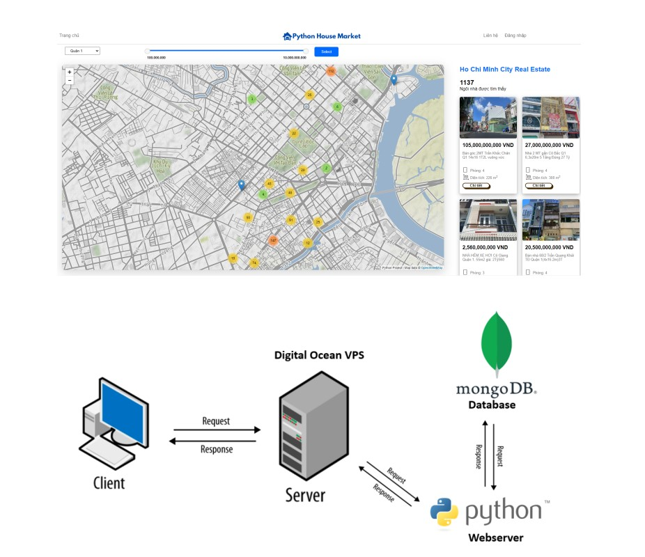
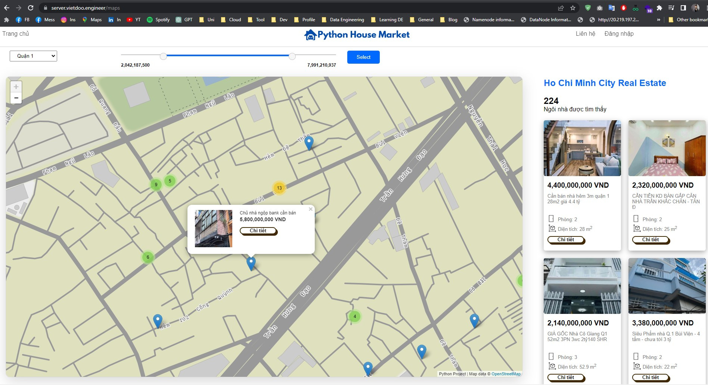

# Real Estate Marketplace
The webapp you envision would allow users to easily visualize homes for sale on a cluster map, with data continuously fetched from a MongoDB database. In order to achieve this, the development process would involve several key steps:

Design the user interface: The first step in creating a webapp like this would be to design a user interface that is intuitive and user-friendly. This could involve creating wireframes or mockups of the app, which can be used to test and refine the design.

Develop filtering functions: One important feature of the webapp would be the ability to filter homes based on certain criteria, such as price range, location, or number of bedrooms. This would require developing filtering functions that can search through the MongoDB database and return only the homes that meet the user's specified criteria.

Create APIs: To make the app more flexible and customizable, it would be useful to create APIs that allow other developers to access and manipulate the data in the database. This could involve creating RESTful APIs that provide a simple, standardized interface for accessing the data.

Implement the cluster map: The core feature of the app would be the cluster map, which would allow users to easily visualize the homes for sale in a particular area. This could be implemented using a mapping library such as Leaflet or Mapbox, which provide powerful tools for displaying and interacting with geographic data.

Continuous data fetching: To ensure that the data displayed on the cluster map is always up-to-date, the app would need to continuously fetch data from the MongoDB database. This could be accomplished using a background process or by periodically polling the database for updates.

Overall, developing a webapp like this would require expertise in several different areas, including web development, database management, and geographic data visualization. However, with the right team and tools in place, it is certainly feasible to build a high-quality app that provides valuable insights into the real estate market.

## Technology
frontend: Leaflet.js 
backend: Python, Flask, Mongo.



## Usage
```
pip install -r "requirements.txt"
flask run
```
Server run at http://localhost:5000

## Demo


